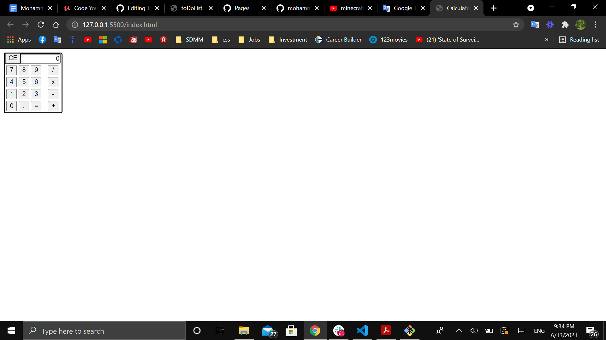

# Vanilla JavaScript Calculator-App 

#### A simple Calculator-App written entirely in Javascript, HTML, and CSS.

#### Play it [here](https://mohammedq91.github.io/Calculator-App/)

## Summary
This project was written in HTML, JavaScript, and CSS. The purpose of this app was to help me to further enhance my JavaScript skills. I learned how to grab one HTML element from an HTML collection, node list of HTML element, Node list forEach method, looping through an array element by element, split strings into array then convert arrays back to strings, adding two numbers, continuous functions, apply decimals when pressed, convert strings to numbers, display at least 10 digits on the screen, and display decimals to at least the thousandth.

## Author

- **Mohammed Qaralos** - *Self taught Software Developer* - [LinkedIn](https://www.linkedin.com/in/mohammed-qaralos-27151010a/)
